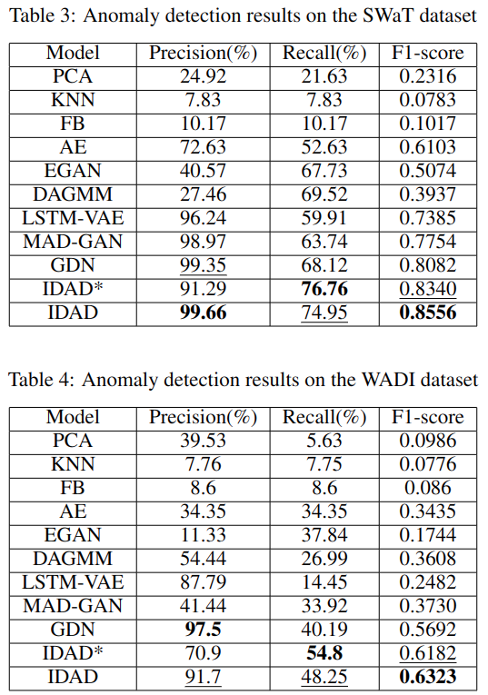
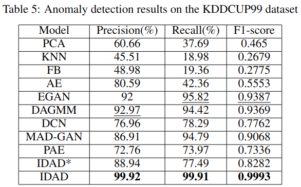
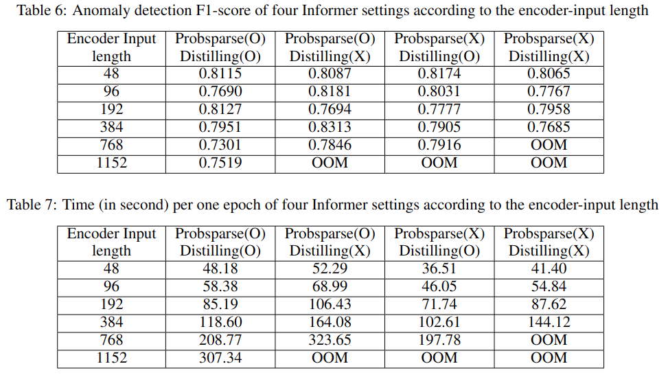

# Informer 기반 이상치 탐지

## 사용 환경

```
CUDA Tookit version==11.1
matplotlib == 3.1.1
numpy == 1.19.4
pandas == 0.25.1
scikit_learn == 0.21.3
torch == 1.8.0
tensorflow-gpu==2.3.0rc0
```

## 모델 결과

[model_weights](https://drive.google.com/drive/folders/1fS87tveAffNPLDaR8yMeUBKecFKYGYu7?usp=sharing)

## 제안 모델 실행

#### 1) Informer_XXX.ipynb
각 데이터 별 Informer 모델(시계열 데이터 예측) 학습

#### 2) Anomaly_detection_XXX_threshold.ipynb
1)의 결과를 통해 얻어진 Informer 모델을 바탕으로 특정 threshold보다 클 경우 이상치로 판단하는 모델

#### 3) Anomaly_detection_XXX_deeplearning.ipynb
1)의 결과를 통해 얻어진 Informer 모델을 바탕으로 이진 분류 딥러닝 모델을 학습하여 이상치를 판단하는 모델


## 결과

<p align="center"></p>

<p align="center"></p>

<p align="center"></p>

## Contributiong / 기여자

* 양동욱(dongwook412@naver.com)
* 황보성훈(thehb01@gmail.com)
